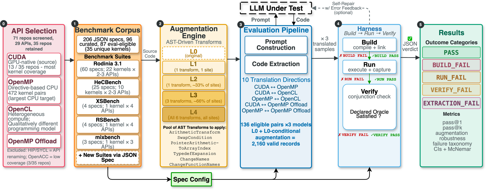

# ParBench — A Kernel-Centric Benchmark for Evaluating LLM-Based Parallel Code Translation

Translating parallel code between programming APIs (CUDA, OpenMP, OpenCL, OpenMP target
offload) is a long-standing porting burden in high-performance computing, and large language
models now attempt it with uneven, hard-to-compare results. ParBench is an **evaluation
harness** for measuring exactly that: you bring a parallel benchmark suite, describe each
kernel in a machine-readable spec, and the harness builds, runs, and verifies every
LLM-produced translation so that results are comparable across models, suites, and
translation directions.

ParBench is **not a translator**. It does not translate code itself and it ships no model.
It is the measurement instrument: prompt construction, code extraction, build → run → verify,
and a declared correctness oracle per kernel, with every outcome recorded as a JSON verdict.

<p align="center">
  
</p>
<p align="center"><em>ParBench end-to-end pipeline: API selection → benchmark corpus → augmentation → evaluation → harness → results.</em></p>

## Bring your own suite

The five bundled suites below are a starting corpus, not a boundary. Any parallel benchmark
can join the harness by writing one spec file per kernel variant against
`schema/spec_schema.json` and appending one line to `manifest.jsonl`. Translation pairs,
prompt payloads, and verification then work for the new suite exactly as they do for the
bundled ones. See **[docs/adding-a-suite.md](docs/adding-a-suite.md)** for the full path and
**[CONTRIBUTING.md](CONTRIBUTING.md)** for how to propose one.

## Benchmark corpus

ParBench bundles 206 spec files covering 90 unique kernels from five HPC suites, across four
parallel APIs (CUDA, OpenMP, OpenCL, OpenMP target offload). The paper's evaluation uses a
curated subset: 96 curated specs, of which 87 are eval-eligible, forming 136 eligible
translation pairs.

| Suite | Kernels | Spec files | APIs | Source |
|-------|---------|------------|------|--------|
| [Rodinia](https://rodinia.cs.virginia.edu/) | 22 | 60 | CUDA, OpenMP, OpenCL | Git submodule (`rodinia/rodinia-src/`, commit `9c10d3ea`) |
| [HeCBench](https://github.com/zjin-lcf/HeCBench) | 65 | 135 | CUDA, OpenMP, OpenMP target | Fetched by SHA (`HeCBench-master/`, gitignored) |
| [XSBench](https://github.com/ANL-CESAR/XSBench) | 1 | 4 | CUDA, OpenMP, OpenCL, OpenMP target | Fetched by SHA (`xsbench/xsbench-src/`) |
| [RSBench](https://github.com/ANL-CESAR/RSBench) | 1 | 4 | CUDA, OpenMP, OpenCL, OpenMP target | Fetched by SHA (`rsbench/rsbench-src/`) |
| [mixbench](https://github.com/ekondis/mixbench) | 1 | 3 | CUDA, OpenMP, OpenCL | Fetched by SHA (`mixbench/mixbench-src/`) |

Only `rodinia` is a git submodule. The other four trees are fetched at pinned commits;
**[docs/benchmark-tree-pins.md](docs/benchmark-tree-pins.md)** records the SHAs and the
fetch recipes. The append-only `manifest.jsonl` (211 entries) indexes all spec files and
enables automatic discovery of translation pairs across APIs.

## Installation

Python 3.12 or later is required.

```bash
git clone https://github.com/Scientific-Computing-Lab/ParBench.git
cd ParBench

python3 -m venv venv
source venv/bin/activate

# Exact pinned versions (the reproducible environment; recommended)
python3 -m pip install -r requirements-lock.txt

# Or unpinned core dependencies (harness, schema validation, augmentation)
python3 -m pip install -r requirements.txt

# Install the project itself, so `python3 -m harness` and the analysis
# scripts resolve from any directory
python3 -m pip install -e .
```

Optional dependency groups from `pyproject.toml`:

```bash
python3 -m pip install ".[eval]"      # LLM evaluation pipeline (anthropic, openai clients)
python3 -m pip install ".[analysis]"  # Analysis and figure generation (matplotlib, numpy)
python3 -m pip install ".[dev]"       # Development tools (pytest, ruff)
python3 -m pip install ".[all]"       # Everything
```

Building and running kernels additionally requires compilers for the target APIs (`nvcc` for
CUDA, `g++` with `-fopenmp` for OpenMP, OpenCL headers and runtime for OpenCL). On Ubuntu,
the OpenMP path needs only `sudo apt-get install build-essential` (`g++` and `make`). Tested
versions are listed in `config/compiler_inventory.txt`.

## Quick start

Run these from the repository root, with the virtual environment from **Installation** above
active.

```bash
source venv/bin/activate

# 1. Fetch the Rodinia sources (the only submodule; ~101 MB)
git submodule update --init rodinia
ln -s . rodinia/rodinia-src   # the specs address the tree as rodinia/rodinia-src

# 2. Validate one spec against the schema (exits 0 on a fresh clone)
python3 scripts/validate_schema.py --spec specs/rodinia-nw-omp.json

# 3. Build, run, and verify one kernel (OpenMP — needs only a multi-core CPU;
#    nw generates its own input matrix, so no data download is required)
python3 -m harness verify specs/rodinia-nw-omp.json

# 4. List all valid translation pairs (e.g., CUDA to OpenMP)
python3 -m harness pairs
```

Step 1's symlink is required, not optional: the submodule checks out at `rodinia/`, while
every Rodinia spec declares its `repo_root` as `rodinia/rodinia-src`. Without the link,
validation reports a missing source directory for every Rodinia spec, and `harness verify`
stops with "Working directory does not exist".

`python3 scripts/validate_schema.py --all` is the full-corpus check, and it is **expected to
exit nonzero on a fresh clone**: it reports missing source files for every benchmark tree you
have not fetched yet, plus three errors for each of the five retired manifest entries
described under [Validation](#validation). Run it once the trees you care about are in place, and read its
error list rather than its exit code.

Two platform notes. (1) OpenMP kernels need a compiler with `-fopenmp` (GNU g++; Apple's
clang on macOS does not support it — use Linux, the tested platform). The bundled OpenMP
Makefiles hardcode `CC = g++` and the harness passes no compiler override, so whatever is
named `g++` on your PATH must be a real GNU g++; on macOS that means putting Homebrew's gcc
ahead of Apple's clang shim, and there is no flag that points the harness at a differently
named compiler. (2) Rodinia kernels
that read input files (bfs, hotspot, srad, ...) additionally need the separate
[Rodinia data package](https://rodinia.cs.virginia.edu/), unpacked to
`rodinia/rodinia-src/data/`; kernels with self-generated inputs (nw, lud, pathfinder,
backprop, ...) run without it.

To evaluate an LLM on translation pairs, see
**[docs/running-evals.md](docs/running-evals.md)**.

## Results data

The repository ships the paper's aggregate analysis outputs in `results/analysis/final/`
(canonical build of 2026-08-13: 2,344 evaluation records, of which 184 are excluded by the
pre-registered eligibility rules, leaving 2,160 valid records over 136 translation pairs and
three models). These JSON and CSV files carry every number in the paper: pass@k tables,
direction asymmetry, augmentation trends, the failure taxonomy, and per-suite results.

Raw per-task records are not tracked in this repository. They ship instead inside the
self-contained reproducibility artifact (Docker image recipe, raw records, and
`reproduce.sh`), published as the asset `parbench-artifact-neurips2026.zip` on the
[neurips2026-artifact release](https://github.com/Scientific-Computing-Lab/ParBench/releases/tag/neurips2026-artifact).
**[artifact/README.md](artifact/README.md)** documents that archive and
**[docs/reproducing-paper.md](docs/reproducing-paper.md)** explains both reproduction paths.

## Project structure

```
ParBench/
├── README.md                       # This file
├── manifest.jsonl                  # Master index (append-only, one JSON object per line)
├── schema/                         # JSON Schemas (draft-07) for manifest and specs
├── specs/                          # One spec file per kernel variant
├── templates/spec_template.json    # Blank spec with all fields
├── harness/                        # Build, run, verify automation (python3 -m harness)
├── c_augmentation/                 # AST-driven, semantics-preserving code transforms
├── scripts/                        # Validation, evaluation, analysis utilities
├── docs/                           # Guides: adding a suite, running evals, reproducing
├── results/analysis/final/         # Canonical aggregate results (the paper's numbers)
├── expected_outputs/               # Reference outputs for bit-exact table verification
├── artifact/                       # Reproducibility artifact (Dockerfile, reproduce.sh)
└── config/                         # Pair contracts and paths.json (tracked, sanitized defaults)
```

## Spec anatomy

Each kernel variant is described by one JSON spec (draft-07 schema in
`schema/spec_schema.json`). Key sections:

- **identity** — unique_id, kernel name, API, source suite
- **provenance** — repository URL, pinned commit, license
- **files** — `prompt_payload` (LLM sees), `support_files` (build only), `verification_only` (never shown to LLM)
- **build / run** — environment, commands, executable, arguments, timeout
- **verification** — method, strategies, floating-point tolerance
- **hardware** — target device, requirements, reference platform

### File security model

The `files` section protects evaluation integrity:

- `prompt_payload` — files the LLM receives for translation. **Only** these enter the prompt.
- `support_files` — Makefiles and shared headers needed for compilation, **not** sent to the LLM.
- `verification_only` — reference implementations and test harnesses, **never** shown to the LLM.

No file may appear in both `prompt_payload` and `verification_only`; the validator enforces
this.

## Validation

```bash
python3 scripts/validate_schema.py --manifest manifest.jsonl   # manifest only
python3 scripts/validate_schema.py --spec specs/rodinia-bfs-cuda.json   # one spec
python3 scripts/validate_schema.py --all                       # everything
```

The validator checks schema conformance, `unique_id` naming and format, API consistency, that
every listed file exists on disk, and the prompt/verification separation above. A single-spec
run exits 0. The `--all` run does not, because two classes of errors are expected and are
explained in its output: (1) specs whose benchmark tree you have not fetched yet report
missing source files (fetch the tree, per the table above, and they clear); (2) five retired
manifest entries remain permanently, contributing three errors each (the manifest is append-only, so
it retains entries whose spec files were deleted). Judge `--all` by its error list, not by its
exit status.

## Requirements

- **Reproducing paper tables and figures:** any x86_64 machine, no GPU (~4 GB RAM).
- **Running CUDA/OpenCL specs:** NVIDIA GPU (compute capability ≥ 7.0, e.g., RTX 3060+).
- **OpenMP-only specs:** any multi-core x86_64 CPU.
- **Tested platform:** NVIDIA RTX 4070, AMD Ryzen 9 7900X, Ubuntu 24.04, NVIDIA HPC SDK 24.3.

## Testing

```bash
bash scripts/run_public_tests.sh                         # unit suite minus tests whose subjects are not in this release
python3 -m pytest tests/                                 # full suite (some tests need files outside this release)
python3 -m pytest c_augmentation/test_transforms.py -v   # augmentation transform tests
python3 scripts/validate_schema.py --all                 # schema validation (see above on its exit status)
```

`pytest` comes from the `[dev]` dependency group.

## License

MIT (see `LICENSE`). The bundled benchmark suites are fetched from their upstream
repositories and keep their own upstream licenses; ParBench does not vendor them.

## Citation

To cite the software, use `CITATION.cff` in the repository root; GitHub renders it as a
ready-to-paste BibTeX or APA entry under "Cite this repository". It also carries the
preferred citation for the paper, "ParBench: A Kernel-Centric Benchmark for Evaluating
LLM-Based Parallel Code Translation" (NeurIPS 2026), which describes the benchmark design and
the evaluation results. The arXiv link and DOI will be added to `CITATION.cff` when the
camera-ready version is published.
